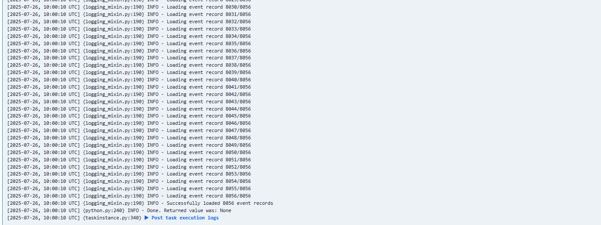
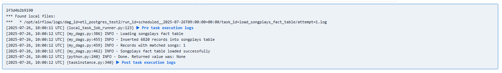
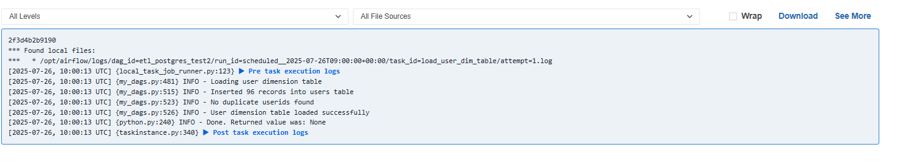
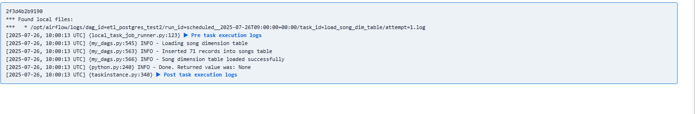
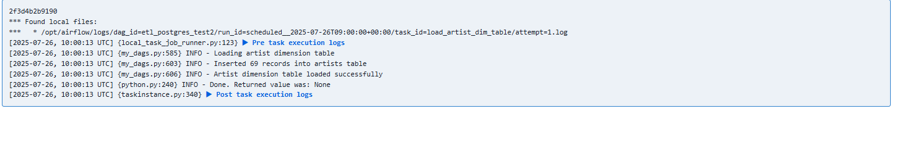
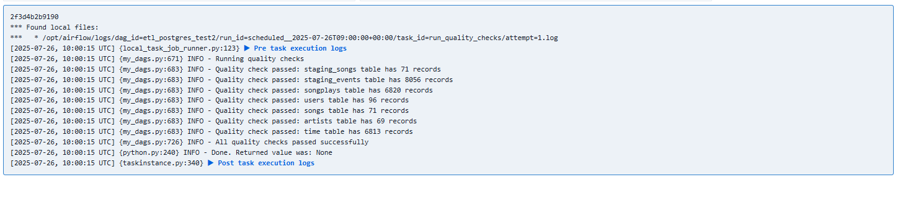
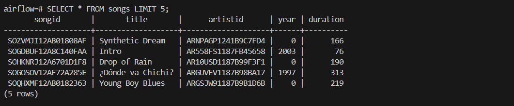
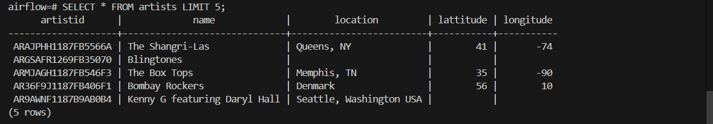
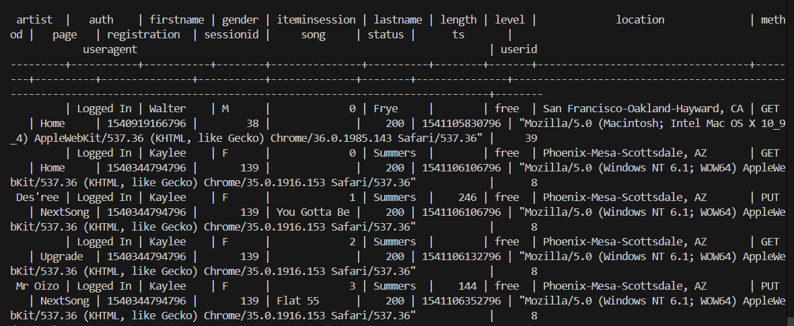
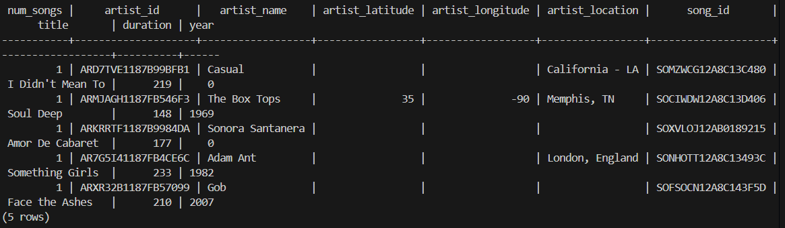

# Các bước cài đặt và sử dụng project 
## Bước 1 : clone repo này về máy
## Bước 2 : Khởi tạo các container : 
Mở folder ứng với project này, chọn new terminal và chạy lệnh : docker-compose up --build
Sau đó mở cổng 8080 và đảm bảo thấy giao diện airflow webserver : 

## Bước 3 : đảm bảo airflow connect với postgreSQL
có thể chạy lệnh sau để kiểm tra xem có kết nối được với postgresql không : 
docker exec -it fpt_airflow_training-postgres-1 psql -U airflow -d airflow
## Bước 4 : Trigger dag etl_postgre_test2 
Sau khi trigger dag, có thể kiểm tra graph để xem luồng hoạt động như hình bên dưới :
graph dag :

## Bước 5 : check log 

log dag create table : 

log dag stage_songs : 

log dag stage_events : 

log dag load_songplays_fact_table : 

log dag load_user_dim_table : 

log dag load_song_dim_table : 

log dag load_artist_dim_table : 

log dag load_time_dim_table : 

log dag run_quality_check : 

## Bước 6 : kiểm tra data trong các bảng : 
bảng songs

bảng users

bảng artist

bảng time

bảng songplays

bảng staging_events: 

bảng staging_songs:

